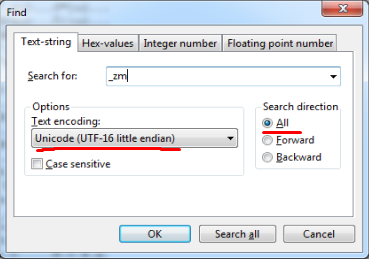
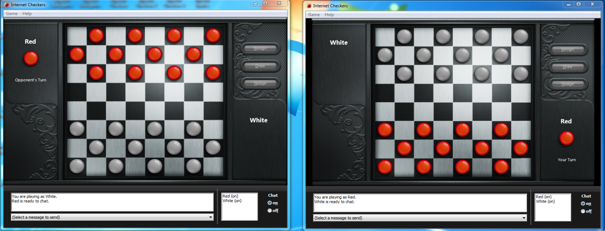

# Running multiple instances of a Windows 7 Internet Game

This document covers how the Windows 7 Internet Games implement protection against creating multiple instances
of the same game, and how to bypass it for various purposes (for example, testing the Internet Games Server).

## How it works

On startup, the executable of any of the Internet Games creates a named mutex, using the [`CreateMutexW`](https://learn.microsoft.com/en-us/windows/win32/api/synchapi/nf-synchapi-createmutexw) function.


According to the function's documentation, its third parameter is `LPCWSTR lpName` - the name of the mutex object.

After we have hit the breakpoint on the function, we can check what `r8` points to.


Going to ```00000000`ff8f12b0``` in the memory viewer leads us to the following string:


This is the name of the mutex. If an instance of the same game already exists, the creation of the mutex fails for the following reason:

> If the mutex is a named mutex and the object existed before this function call, the return value is a handle to the existing object, and the GetLastError function returns ERROR_ALREADY_EXISTS.

If the mutex already exists, the game performs a few additional tasks, like focusing on the window of the other active instance, before closing.

Running multiple instances of different Internet Games is not an issue, since they all use a unique mutex name in their executable.

## Bypassing the protection

1. Install a Hex editor, like [HxD](https://mh-nexus.de/en/hxd/), which will be used here.

2. Go to "C:\Program Files\Microsoft Games\Multiplayer" and create a full copy of the game's folder.


> [!NOTE]
>
> A full folder copy needs to be done, because of a "Parental Controls" issue, when launching a renamed game executable.
>
> 
>
> In that case, the executable needs to use the same name, thus has to be in a different directory.
>
> The whole directory is copied, so the included DLLs are available from the new executable.

3. Start HxD as administrator and open the executable, located in the copy folder.

4. Search for the "_zm" Unicode string.

> 

5. Modify any part of the found mutex name string, so it's different from the one in the main executable.

> 

For example, let's change it from "mchkr_zm" to "mcckr_zm".

> 

> [!NOTE]
>
> If you wish to run more than two instances of the same game, you must make sure this string is different in each executable.
> Different edits must be done.

6. Press Ctrl+S, or go to File -> Save to save the changes.

7. Launch both the original and the copied executable. You now have two running instances of the same game!

> 

You can create shortcuts to each executable for convenience.
